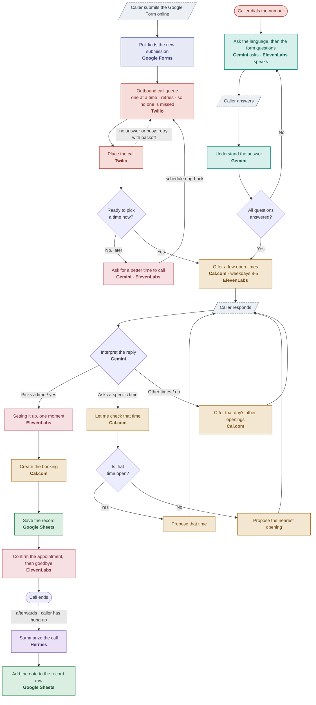

# Voice Intake Agent

A phone agent that **collects a person's details from a Google Form, calls them back, and books an appointment by voice** — speaking in English or Korean, checking live calendar availability, and recording everything as it goes.

It answers inbound calls too. The whole conversation is a turn-by-turn state machine: our code drives the flow, and specialized services do the parts they're best at (understanding speech, talking, scheduling).

---

## What it does, end to end

1. Someone **submits the Google Form** (name, email, phone, language, desired timeframe).
2. A background **poller** notices the new submission and the agent **calls them back**.
3. The agent greets them and asks if they're **ready to schedule**.
   - Not a good time? It asks when to call back and **schedules a ring-back** for that time.
4. It offers a few **open appointment slots** (pulled live from Cal.com, business hours only).
5. The caller can **pick one**, **ask about a specific time**, or **ask for other times that day** — all in natural language.
6. Once a time is agreed, it **books the appointment**, **saves the record**, and **confirms**.

It also works the other direction: a person can **dial the number**, answer the questions by voice, and book — the same engine handles both.

---

## How the flow works

*Renders on GitHub. Also available as an image — [PNG](docs/voice-agent-flowchart.png) · [SVG](docs/voice-agent-flowchart.svg) — from source [`docs/flowchart.mmd`](docs/flowchart.mmd).*



---

## The services (who does what)

Our code owns the conversation; each external service handles one job:

| Service | Role in the app | Code |
|---|---|---|
| **Google Forms** | Supplies the questions to ask, and (via polling) the submissions that trigger a callback | `tools/google_forms.py` |
| **Gemini** (`google-genai`) | The "brain": understands answers, interprets scheduling replies, resolves spoken times, translates | `tools/gemini.py` |
| **ElevenLabs** | The voice: turns each agent line into speech (English + Korean, one voice) | `tools/voice.py` |
| **Cal.com** | Live availability and the actual booking | `tools/cal.py` |
| **Google Sheets** | Tracks each completed intake as a row | `tools/sheets.py` |
| **Twilio** | The phone line — inbound webhooks and outbound calls | `telephony/server.py` |
| **Hermes** | Self-hosted agent that writes a short **post-call summary** into the tracking sheet — off the critical path (the caller has already hung up) | `tools/hermes.py`, `agent/summary.py` |

Auth reuses one Google service account for **both** Sheets and Forms (a JWT signed with the service-account key, exchanged for an access token).

---

## How the agent conversation works

The conversation engine is **`CallSession`** (`agent/call_session.py`) — a turn-by-turn state machine shared by phone and terminal. Two methods drive it:

- `start()` → the agent's opening line (it speaks first).
- `handle(caller_text)` → advances one turn, returning a **`Turn(reply, next)`**.

`Turn.next` tells the caller-facing layer what to do after speaking the reply:

| `next` | Meaning |
|---|---|
| `"listen"` | Speak the reply, then wait for the caller |
| `"check"` | Speak "let me check…", then look up availability while it plays |
| `"finalize"` | Speak "one moment…", then book + save while it plays |
| `"hangup"` | Speak the reply and end the call |

### The states

```
inbound:   intake ─► scheduling ─► (booking) ─► done
outbound:  confirm ─► scheduling ─► (booking) ─► done
                └─► callback ─► done         (if "not ready")
```

- **intake** — asks each form question in turn; Gemini extracts the answer from free speech and loops until every field is captured. (Inbound only; outbound calls already have the answers from the form.)
- **confirm** — the outbound opener ("are you ready to pick a time?"). Gemini classifies the reply as *ready* or *not ready*.
- **callback** — if not ready, asks *when* to call back, resolves the spoken time (e.g. "tomorrow at 2") to a concrete time, and queues a ring-back.
- **scheduling** — offers a few live, business-hours slots. Gemini interprets the reply as one of: **pick** a slot · **request** a specific time · **others** (hear more that day) · **decline** · **unclear**.
- **checking / confirm_slot** — when the caller names a specific time, it checks Cal.com and proposes that exact time or the **nearest** opening for a yes/no.
- **booking** — two-phase: acknowledge ("setting it up, one moment"), then book + save while that plays, then confirm — so there's no dead air.

### Key behaviors

- **Two-phase booking** — the slow work (Cal.com booking + Sheets write) happens *behind* a spoken acknowledgement, hiding latency.
- **Natural "no" handling** — "that doesn't work, any other times?" routes to offering other slots, not a dead end.
- **Outbound queue — no one is missed** — *every* outbound call (first-contact and ring-back) goes through one persisted queue that places calls **one at a time**, waits for each to finish, and **retries** failures (busy / no-answer / couldn't-place) with backoff before giving up. Safe even on a Twilio trial (1 concurrent call). Ring-backs are scheduled for the caller's requested time and use a **different greeting** ("I'm calling back at the time you requested…").
- **Language** — the form's language answer (or the first inbound question) picks English or Korean; every agent line is translated and spoken in that language.
- **Phone normalization** — form phone answers are plain text, so outbound numbers are normalized to E.164 (`4254787534` → `+14254787534`) before Twilio dials.
- **Post-call summary** — once a call ends and the record is saved, the **Hermes** agent writes a one-line human-readable note ("Jordan Lee called and booked … Friday at 9 AM") into the row's `summary` column. This runs in a background thread, so it never delays the caller; it degrades to no note if Hermes is unreachable.

---

## The phone layer

`telephony/server.py` is a small Flask app bridging Twilio and `CallSession` — **no Twilio SDK**, just webhooks:

- `POST /voice/incoming` — greets and `<Gather>`s the caller's speech.
- `POST /voice/turn` — runs `CallSession.handle()` on Twilio's `SpeechResult`, speaks the reply, gathers again.
- `POST /voice/check` and `/voice/finalize` — the deferred availability lookup and booking (the two-phase steps).
- `GET /audio/<id>.mp3` — serves the ElevenLabs audio each line is spoken from (falls back to Twilio `<Say>` if TTS fails).
- `GET /health` — liveness.

Two background threads run alongside it:

- **`GoogleFormsPoller`** (`telephony/poller.py`) — checks the Forms API every 30s; each new submission with a phone number is **enqueued** (not dialed directly). This is the no-webhook path — an ordinary outbound API call, so **no public HTTPS endpoint is required** (Google Forms has no simple push webhook anyway).
- **`OutboundQueue`** (`telephony/outbound.py`) — the single worker that actually places calls: one at a time, waiting for each to complete, retrying failures with backoff. Persisted to `data/outbound_queue.json` so a restart never drops a pending call.

---

## Project layout

```
src/voice_agent/
  config/settings.py     # all env-backed configuration (Config.load())
  agent/
    call_session.py      # the turn-by-turn conversation state machine
    intake.py            # IntakeField + question-asking / Gemini extraction
    scheduler.py         # Cal.com slots, decide(), time parsing, helpers
    fulfillment.py       # Sheets tracking (append record row, attach summary)
    summary.py           # Hermes-written post-call summary
  tools/
    gemini.py  voice.py  cal.py  sheets.py  google_forms.py  hermes.py
  telephony/
    server.py            # Flask <-> Twilio bridge
    poller.py            # GoogleFormsPoller (submission -> enqueue)
    outbound.py          # OutboundQueue (all calls, one at a time, retried)
scripts/
  run_phone.py           # run the phone server
  place_call.py          # place a one-off outbound call
  checks/                # connectivity & health checks (verify_*, diagnose_forms, show_form)
  dev/                   # interactive dev tools (try_intake, chat_hermes)
docs/                    # the flow chart (mmd / html / png / svg)
data/                    # runtime state (git-ignored): poll cursor, outbound queue
```

---

## Setup

Requires **Python 3.11+**.

```bash
python -m venv .venv
source .venv/bin/activate          # Windows: .venv\Scripts\activate
pip install -e .                   # editable install (src layout)
cp .env.example .env               # then fill it in (see below)
```

### Configuration (`.env`)

`.env` is **git-ignored** — it holds real credentials and must be created on each machine (it does **not** travel with `git pull`).

| Variable | Purpose |
|---|---|
| `GEMINI_API_KEY` | Gemini (understanding, interpretation, translation) |
| `ELEVENLABS_API_KEY`, `ELEVENLABS_VOICE_ID` | The spoken voice |
| `GOOGLE_FORM_ID` | The form (accepts a raw id or the **editor** URL — not a `forms.gle` link) |
| `GOOGLE_API_EMAIL`, `GOOGLE_API_SHEETS_KEY` | Service account (shared by Forms **and** Sheets) |
| `GOOGLE_SHEETS_ID` | The tracking spreadsheet |
| `CAL_API_KEY`, `CAL_EVENT_TYPE_ID` | Cal.com scheduling |
| `ACCOUNT_SID`, `TWILIO_AUTH_TOKEN`, `PHONE_NUMBER` | Twilio phone line |
| `PUBLIC_BASE_URL` | How Twilio reaches this server, e.g. `http://<box-ip>:3001` |
| `PORT` | Port the server listens on (default 3000) |

**Google one-time setup:** enable the **Google Forms API** in the Cloud project, and share **both** the form and the sheet with `GOOGLE_API_EMAIL` as an **Editor** (viewer isn't enough for the Forms API). The form needs a **phone-number question** or there's no one to call back.

---

## Running it

### The phone server

```bash
python scripts/run_phone.py            # answer inbound calls only
python scripts/run_phone.py --poll     # also poll the Google Form and call submitters back
```

Point your Twilio number's Voice webhook at `PUBLIC_BASE_URL/voice/incoming`. To place a one-off outbound call: `python scripts/place_call.py <number>`.

### Test the conversation without a phone (`scripts/dev/`)

```bash
python scripts/dev/try_intake.py       # type as the caller; drives the same CallSession
#   --demo      built-in questions      --voice     speak each line via ElevenLabs
#   --outbound  simulate agent-calls-out --book     actually create the Cal.com booking
```

### Inspect & verify (`scripts/checks/`)

```bash
python scripts/checks/show_form.py         # list the questions the agent will ask
python scripts/checks/diagnose_forms.py    # health-check the Forms -> callback pipeline (read-only)
python scripts/checks/verify_cal.py        # Cal.com connectivity + event types
python scripts/checks/verify_sheets.py     # Sheets auth + append
python scripts/checks/verify_voice.py      # ElevenLabs TTS
```

---

## Deploying (self-hosted box)

```bash
cd ~/voice-agent && git pull
source .venv/bin/activate               # the package lives in the venv
pkill -9 -f run_phone                    # stop the old server
nohup python scripts/run_phone.py --poll > ~/server.log 2>&1 &
```

Notes:
- Remember to update the **box's own `.env`** for config changes — it isn't in git.
- The callback thread starts regardless of `--poll`, so ring-backs always fire.
- Watch `~/server.log`; on a good start you'll see `Forms polling -> ON` and `Google Forms poller started`.
